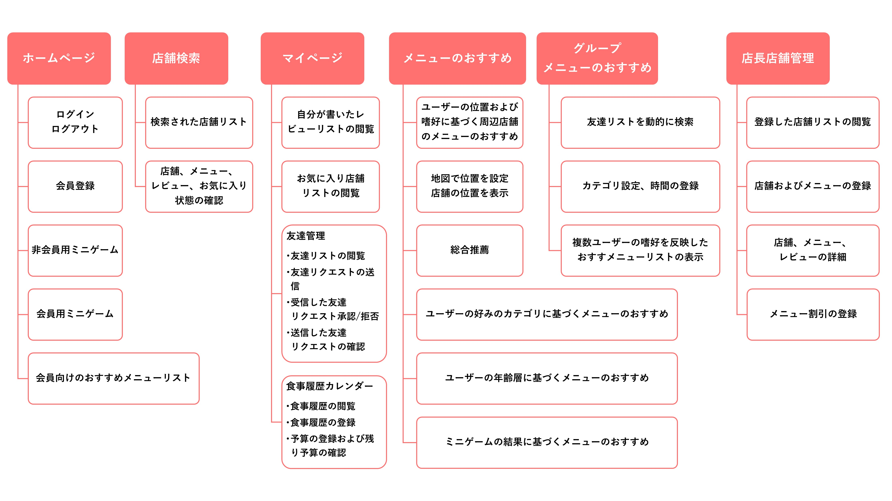
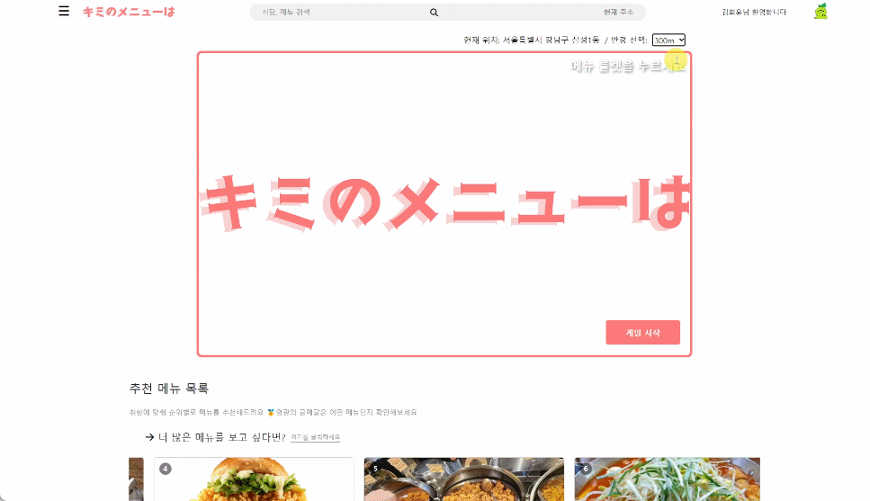
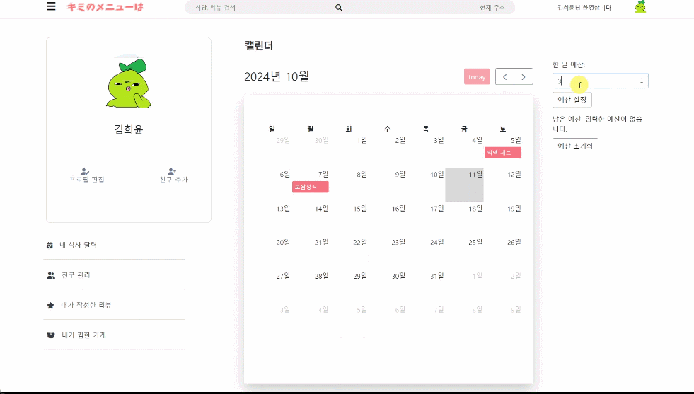
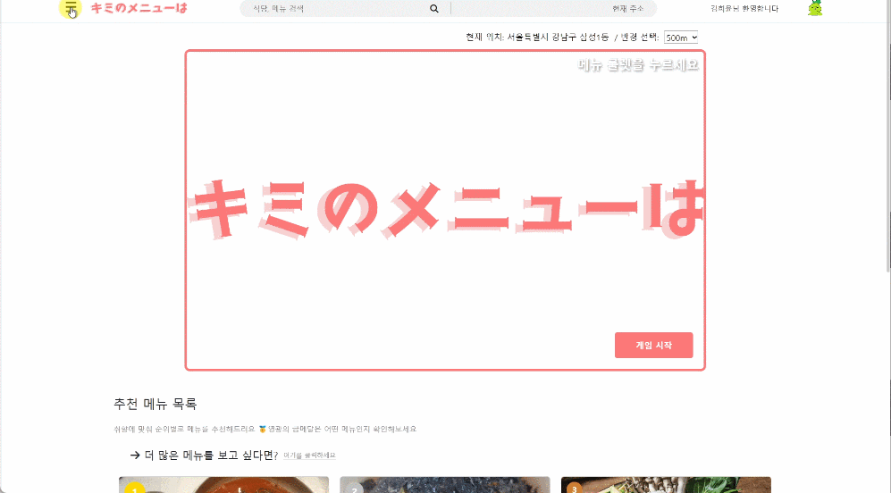
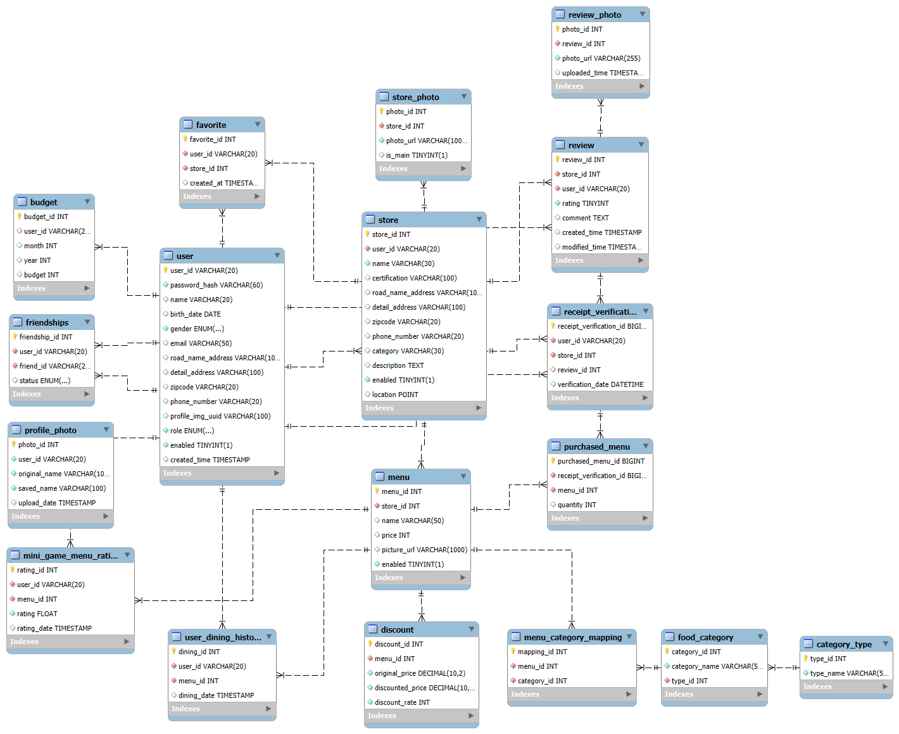

# 🎯 キミノメニューは (Kimi no Menu wa) 🍽️

 <!-- プロジェクトバナーの画像をここに追加 -->

## 📖 プロジェクト概要

「キミノメニューは」は、ユーザーの嗜好を分析し、パーソナライズされたメニューを推薦するサービスです。ユーザーデータに基づいて新しい料理を推薦し、予算に合ったメニューを提案、グループ推薦機能も提供することで、ユーザーの食事選択における悩みを解決します。

---

## 🚀 主な機能

- **🔍 パーソナライズされたメニュー推薦**: ユーザーの嗜好とデータを分析し、精密なメニューを推薦
- **👥 グループ推薦**: グループ内の友人の嗜好に合った料理を推薦
- **📅 食事履歴管理**: ユーザーごとに食事履歴を記録・管理できるカレンダー機能
- **✍ レビュー作成および星評価**: レシート認証を通じて自動的にユーザーデータが更新され、推薦の精度が向上
- **🛠 店主の店舗管理**: 店舗情報の登録や割引メニュー追加機能を提供

---

## 👥 チーム紹介

| 

 | 

 | 

 | 

 | 

 |
|------------------------------------------------------------------------|------------------------------------------------------------------------|------------------------------------------------------------------------|-------------------------------------------------------------------------|------------------------------------------------------------------------|
| 
キム・シニル
                                              | 
キム・ヒユン
                                              | 
パク・ヒョンジ
                                              | 
イ・ソリン
                                               | 
チェ・ジェウォン
                                             |

---

## 🗂 メニュー構造図

 <!-- メニュー構造図の画像をここに追加 -->

---

## 🎥 機能ごとのデモ (GIF)

### **パーソナライズされたメニュー推薦**
 <!-- パーソナライズされたメニュー推薦機能のデモGIFを追加 -->

### **グループ推薦**
 <!-- グループ推薦機能のデモGIFを追加 -->

### **ミニゲーム**
 <!-- ミニゲーム機能のデモGIFを追加 -->

### **食事履歴管理**
 <!-- 食事履歴管理機能のデモGIFを追加 -->

### **レビュー作成および星評価**
 <!-- レビュー作成および星評価デモGIFを追加 -->

---

## 🛠 技術スタック

### 🌐 **フロントエンド**

### 🖥 **バックエンド**

### ☁️ **インフラ / 環境**

---

## 📊 データベース構造 (ERD)

 <!-- ERD図の画像をここに追加 -->

- **User (ユーザー)**: ユーザー情報を保存するテーブル
- **Menu (メニュー)**: 食品メニューデータを保存するテーブル
- **Preference (嗜好)**: ユーザーの食品嗜好データを保存するテーブル
- **Friendships (友達)**: ユーザーが管理する友達リストを保存
- **Review (レビュー)**: ユーザーが作成した食品レビューと星評価を保存
- **Store (店舗)**: 店舗情報を保存するテーブル

---

This translation should work well for your README in Japanese while keeping all the links and image paths the same!