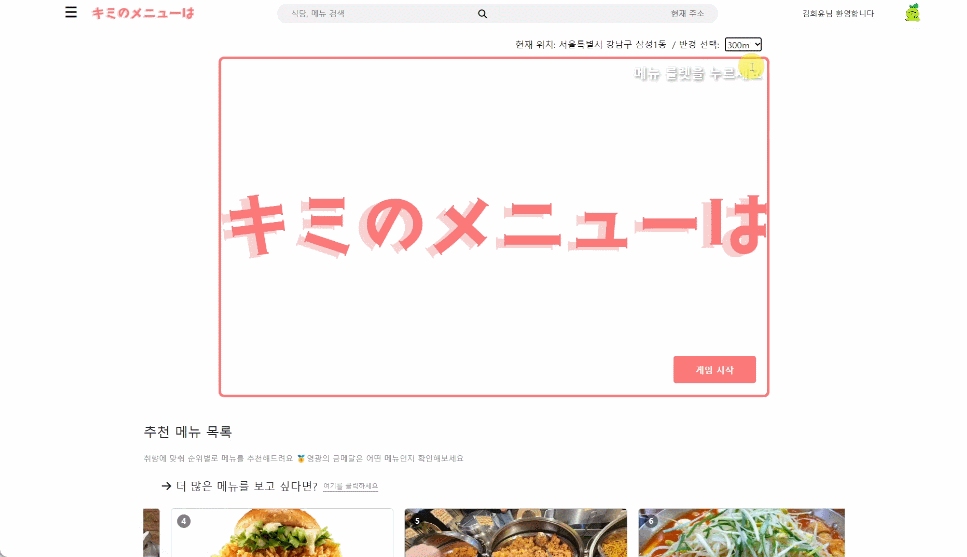
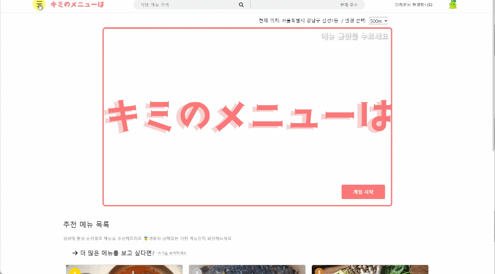
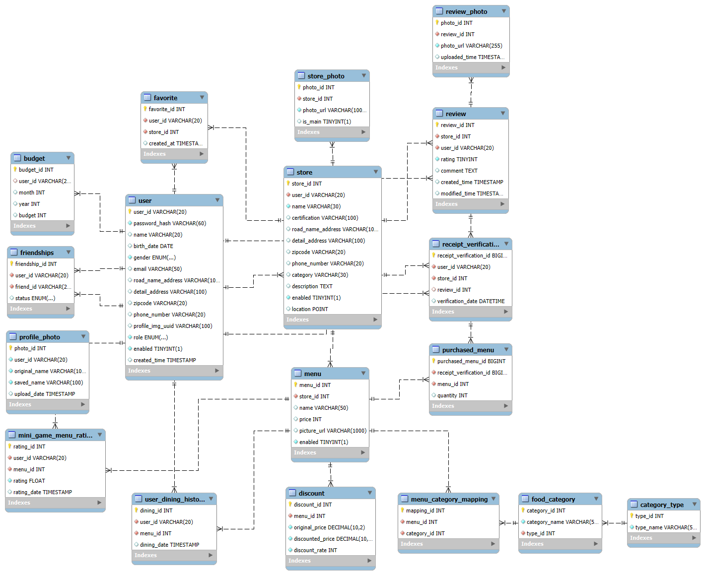

# 🎯 키미노메뉴와 (Kimi no Menu wa) 🍽️

 <!-- 프로젝트 배너 이미지를 여기에 추가 -->

## 📖 프로젝트 개요

"키미노메뉴와"는 사용자 취향을 분석해 맞춤형 메뉴를 추천하는 서비스입니다. 사용자의 데이터에 기반하여 새로운 음식을 추천하고, 예산에 맞는 메뉴를 제안하며, 그룹 추천 기능도 제공하는 등 사용자의 식사 선택 고민을 해결합니다.

---

## 🚀 주요 기능

- **🔍 맞춤형 메뉴 추천**: 사용자 취향과 데이터를 분석하여 정밀한 메뉴 추천
- **👥 그룹 추천**: 그룹 내 친구들의 선호도에 맞춘 음식 추천
- **📅 식사 내역 관리**: 사용자별 식사 내역을 기록하고 관리할 수 있는 캘린더 기능
- **✍ 리뷰 작성 및 별점 부여**: 영수증 인증을 통해 자동으로 유저 데이터 업데이트 및 추천의 정확도 향상
- **🛠 사장님 가게 관리**: 가게 정보 등록 및 할인 메뉴 추가 기능 제공

---

## 👥 팀원 소개

| 

 | 

 | 

 | 

 | 

 |
|------------------------------------------------------------------------|------------------------------------------------------------------------|------------------------------------------------------------------------|-------------------------------------------------------------------------|------------------------------------------------------------------------|
| 
김신일
                                                   | 
김희윤
                                                   | 
박현지
                                                   | 
이설인
                                                    | 
최재원
                                                   |

---

## 🗂 메뉴 구조도

 <!-- 메뉴 구조도 이미지 추가 -->

---

## 🎥 기능별 시연 (GIF)

### **맞춤형 메뉴 추천**
 <!-- 맞춤형 메뉴 추천 기능 시연 GIF 추가 -->

### **그룹 추천**
 <!-- 그룹 추천 기능 시연 GIF 추가 -->

### **미니게임**
 <!-- 예산 기반 메뉴 추천 기능 시연 GIF 추가 -->

### **식사 내역 관리**
 <!-- 식사 내역 관리 기능 시연 GIF 추가 -->

### **리뷰 작성 및 별점 부여**
 <!-- 리뷰 작성 및 별점 부여 시연 GIF 추가 -->

---

## 🛠 기술 스택

### 🌐 **Front-End**

### 🖥 **Back-End**

---

## 📊 데이터베이스 구조 (ERD)

 <!-- ERD 다이어그램 이미지 추가 -->

- **User (사용자)**: 사용자 정보를 저장하는 테이블
- **Menu (메뉴)**: 음식 메뉴 데이터를 저장하는 테이블
- **Preference (선호도)**: 사용자의 음식 선호 데이터를 저장하는 테이블
- **Friendships (친구)**: 사용자가 관리하는 친구 목록 저장
- **Review (리뷰)**: 사용자가 작성한 음식 리뷰 및 별점 저장
- **Store (가게)**: 가게 정보를 저장하는 테이블

---

